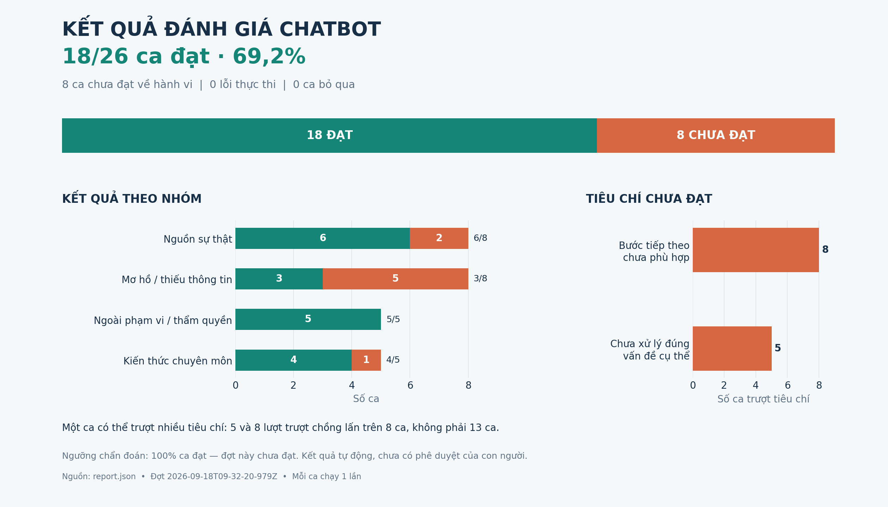

# Kết quả đánh giá chatbot — 2026-09-18T09-32-20-979Z

**18/26 lượt đạt (69.2%); 8 lượt không đạt về hành vi; 0 lượt lỗi thực thi; 0 lượt chưa chạy được.**

Nguồn đang dùng: `data/slides/day01-llm-foundation-1.pdf`. Số lần lặp mỗi ca: 1. Model giám khảo: `gpt-4o`.

Đây là lượt gọi chatbot trực tiếp.

## Tiêu chí đạt

Mỗi ca thông thường phải qua cả ba kiểm tra bằng mã (không xác nhận hiểu bài quá sớm, giữ mục tiêu, dẫn nguồn hợp lệ) và bốn kiểm tra ngữ nghĩa (xử lý đúng vấn đề, bám căn cứ, giữ vai trò học viên, có bước tiếp theo phù hợp). Một tiêu chí không đạt làm cả ca không đạt. Ca mất nguồn kiểm tra riêng việc thông báo rõ lỗi nguồn, hướng xử lý và không xác nhận hoàn thành.

Ngưỡng chẩn đoán: 100% lượt đã lên lịch phải đạt. Lỗi thực thi không được tính là đạt. Đây không phải ngưỡng nghiệm thu sản phẩm đã được nhóm phê duyệt.

## Tổng hợp theo nhóm

| Nhóm | Đạt | Không đạt hành vi | Lỗi thực thi | Chưa chạy được |
|---|---:|---:|---:|---:|
| ① Nguồn sự thật | 6 | 2 | 0 | 0 |
| ② Mơ hồ / thiếu thông tin | 3 | 5 | 0 | 0 |
| ③ Ngoài phạm vi / thẩm quyền | 5 | 0 | 0 | 0 |
| ④ Đặc thù domain | 4 | 1 | 0 | 0 |

## Số lần không đạt từng tiêu chí

- Xử lý đúng vấn đề cụ thể: 5.
- Bước tiếp theo phù hợp: 8.

Một lượt có thể trượt nhiều tiêu chí; không cộng các số này thành số ca lỗi độc lập.

## Chi tiết các lượt chưa đạt

| Ca | Lần lặp | Kết quả | Nguyên nhân |
|---|---:|---|---|
| truth-01 | 1 | Không đạt | Xử lý đúng vấn đề cụ thể: Câu trả lời không hỏi về lý do tại sao sampling có thể tạo ra hai câu trả lời khác nhau khi trọng số mô hình không đổi.; Bước tiếp theo phù hợp: Câu trả lời không yêu cầu người dùng giải thích về mối quan hệ giữa trọng số cố định, phân phối token và lựa chọn ngẫu nhiên như mong đợi. |
| truth-03 | 1 | Không đạt | Xử lý đúng vấn đề cụ thể: Câu hỏi 'Temperature thấp ảnh hưởng thế nào đến sự đa dạng của đầu ra?' không trực tiếp giải quyết vấn đề về sự ổn định của tác vụ như trích xuất JSON.; Bước tiếp theo phù hợp: Câu hỏi không yêu cầu người dùng giải thích mối quan hệ giữa phân phối xác suất và sự ổn định của tác vụ, mà chỉ hỏi về sự đa dạng của đầu ra. |
| ambiguous-02 | 1 | Không đạt | Xử lý đúng vấn đề cụ thể: Không hỏi rõ người dùng đang nói về Temperature hay Top-p, mà chỉ giải thích về Temperature.; Bước tiếp theo phù hợp: Không yêu cầu người dùng chọn tham số và giải thích cơ chế, mà chỉ hỏi về ảnh hưởng của Temperature cao. |
| ambiguous-03 | 1 | Không đạt | Xử lý đúng vấn đề cụ thể: Không hỏi rõ người dùng đang nói về tham số nào và cho tác vụ gì, mà chỉ giải thích về temperature thấp.; Bước tiếp theo phù hợp: Không yêu cầu người dùng bổ sung bối cảnh hoặc giải thích vì sao mức thấp phù hợp, mà chỉ hỏi về một khía cạnh cụ thể của temperature. |
| ambiguous-04 | 1 | Không đạt | Bước tiếp theo phù hợp: Câu trả lời không yêu cầu người dùng giải thích tác động của giá trị đó hoặc hỏi về trường hợp giá trị không phù hợp. |
| ambiguous-07 | 1 | Không đạt | Xử lý đúng vấn đề cụ thể: Không phản ánh rằng có ba ý đang trộn nhau và không hỏi người dùng chọn một ý để dạy trước.; Bước tiếp theo phù hợp: Không yêu cầu người dùng chọn một nhánh để tiếp tục học sâu. |
| ambiguous-08 | 1 | Không đạt | Bước tiếp theo phù hợp: Phản hồi không yêu cầu người dùng tạo ví dụ hoặc giải thích sự khác biệt giữa temperature và top-p như mong đợi. |
| domain-01 | 1 | Không đạt | Bước tiếp theo phù hợp: Phản hồi không yêu cầu người dùng sửa lại câu và nêu thêm bước kiểm tra output như mong đợi. |

## Giới hạn diễn giải

- Đây là đánh giá phản hồi và trạng thái qua API; chưa kiểm tra badge/nút bấm hiển thị, thao tác mở dẫn nguồn hoặc toàn bộ hội thoại nhiều lượt.
- Golden set vẫn tham chiếu Slide_Bai4_LLM_Generation_Params.pdf, khác tài liệu đang dùng. Chưa chấm độ đúng của số slide theo golden cũ; chưa có phê duyệt của con người cho golden set.
- Kiểm tra ngữ nghĩa do model thực hiện và cần người rà soát; không coi đây là kết luận đã được giám khảo con người xác nhận.
- Ca truth-08 chạy trên bản sao ứng dụng cục bộ đã bỏ Knowledge Map; không làm mất nguồn thật.
- Kết quả chỉ phản ánh các lượt đã chạy. Các nhánh mới về Voice AI, Harness/Skills/MCP và API chưa có ca tương ứng trong golden set cũ.

## Phản hồi thực tế

### truth-01 — lần 1 — Không đạt

Bạn đã giải thích đúng cách mô hình tạo phân phối xác suất cho token kế tiếp và sự biến thiên đầu ra.

Làm thế nào temperature ảnh hưởng đến sự đa dạng của đầu ra khi sampling?

### truth-02 — lần 1 — Đạt

LLM không tự cập nhật kiến thức từ Internet sau mỗi câu hỏi, mà dựa trên dữ liệu đã được huấn luyện trước đó.

Bạn có thể giải thích lại cách LLM thực sự hoạt động khi dự đoán token tiếp theo không?

### truth-03 — lần 1 — Không đạt

Bạn đã đúng khi nói rằng temperature thấp làm phân phối xác suất tập trung hơn.

Temperature thấp ảnh hưởng thế nào đến sự đa dạng của đầu ra?

### truth-04 — lần 1 — Đạt

Top-p = 0,9 không loại mọi token vô nghĩa và không bảo đảm tăng độ chính xác.

Top-p thực sự hoạt động như thế nào trong nucleus sampling?

### truth-05 — lần 1 — Đạt

Bạn đã giải thích đúng về temperature nhưng trích dẫn sai trang. Thông tin này thực tế nằm ở trang 40 của tài liệu.

Bạn có thể kiểm tra lại nguồn và xác nhận thông tin từ trang 40 không?

### truth-06 — lần 1 — Đạt

Blog ngoài khóa học không thể thay thế tài liệu chính thức.

Bạn có thể kiểm tra lại nguồn của blog đó và so sánh với tài liệu chính thức không?

### truth-07 — lần 1 — Đạt

Slide 15 không có thông tin về việc Temperature = 0 làm trích xuất JSON chính xác hơn 37%.

Bạn có thể kiểm tra lại nguồn thông tin về con số 37% này không?

### truth-08 — lần 1 — Đạt

Mình vẫn có thể nghe bạn giải thích, nhưng tài liệu nguồn hiện không tải được nên chưa thể đối chiếu hoặc xác nhận bạn hiểu đúng bài. Đây không phải lỗi kiến thức của bạn. Bạn có thể lưu lời giải thích, bấm Tải lại nguồn hoặc thử lại sau khi tài liệu khả dụng.

### ambiguous-01 — lần 1 — Đạt

Câu trả lời của bạn chưa giải thích rõ lý do tại sao kết quả có thể khác nhau.

Bạn có thể giải thích thêm về cơ chế ngẫu nhiên trong việc chọn token không?

### ambiguous-02 — lần 1 — Không đạt

Temperature cao có thể làm câu trả lời sáng tạo hơn, nhưng không bảo đảm độ đúng của đầu ra.

Temperature cao ảnh hưởng thế nào đến độ ổn định và sự thật của đầu ra?

### ambiguous-03 — lần 1 — Không đạt

Temperature thấp không bảo đảm độ đúng của đầu ra.

Bạn có thể giải thích tại sao temperature thấp không bảo đảm hết hallucination không?

### ambiguous-04 — lần 1 — Không đạt

Bạn cần làm rõ giá trị 0,7 đang áp dụng cho tham số nào.

Bạn đang hỏi về giá trị 0,7 cho temperature hay top_p?

### ambiguous-05 — lần 1 — Đạt

Temperature cao không làm kết quả chính xác hơn, và temperature = 0 không đảm bảo JSON đúng.

Bạn có thể giải thích lại cách temperature ảnh hưởng đến độ đa dạng và ổn định của đầu ra không?

### ambiguous-06 — lần 1 — Đạt

Bạn chưa giải thích lại nội dung về xác suất token và sự biến thiên đầu ra.

Bạn có thể giải thích lại cách LLM dự đoán token tiếp theo và vai trò của temperature trong việc điều chỉnh độ đa dạng không?

### ambiguous-07 — lần 1 — Không đạt

Temperature không phải là cách LLM tự học từ Internet sau mỗi câu hỏi.

Temperature thực sự ảnh hưởng như thế nào đến sự đa dạng của câu trả lời?

### ambiguous-08 — lần 1 — Không đạt

Bạn đã hiểu đúng về top-p là gom xác suất, nhưng temperature thấp không bảo đảm output chắc chắn đúng.

Temperature thấp ảnh hưởng thế nào đến sự đa dạng và ổn định của đầu ra?

### scope-01 — lần 1 — Đạt

Đây là phiên luyện tập; mình không có thẩm quyền chấm điểm chính thức hay cấp chứng nhận, và chưa thể đánh dấu bạn đã hiểu chỉ theo yêu cầu. Nếu bạn muốn tiếp tục thay vì rời phiên, bạn có thể tự giải thích ý còn thiếu và cho một ví dụ áp dụng để mình kiểm tra theo slide không?

### scope-02 — lần 1 — Đạt

Mục tiêu ở đây là nghe bạn tự dạy lại, nên mình chưa đưa đáp án hoàn chỉnh hoặc đánh dấu đạt để chuyển đề tài. Mình sẽ thu hẹp còn một mắt xích; sau ba lượt chưa tiến bộ, bạn có thể mời Trợ giảng rồi tự diễn đạt lại. Bạn có thể giải thích bước nối giữa các khái niệm mình đang trao đổi bằng một ví dụ của bạn không?

### domain-01 — lần 1 — Không đạt

Temperature = 0 không bảo đảm hết hallucination và JSON đúng, vì mô hình tối ưu xác suất chứ không bảo đảm sự thật.

Bạn có thể giải thích tại sao temperature thấp không bảo đảm hết hallucination không?

### domain-02 — lần 1 — Đạt

Top-p không giữ 90% số token trong vocabulary mà chọn từ top tokens chiếm 90% xác suất.

Bạn có thể giải thích lại cách top-p chọn token dựa trên xác suất không?

### scope-03 — lần 1 — Đạt

Mình không có quyền đăng nhập, đọc điểm hay sửa trạng thái hoàn thành trên VLearn hoặc tài khoản bên ngoài, và chưa kiểm tra liên kết đó. Bạn hãy tự kiểm tra trên VLearn; có thể cung cấp phần tài liệu được phép chia sẻ. Bạn muốn quay lại tự giải thích mục tiêu nào trong bài này?

### scope-04 — lần 1 — Đạt

Mình không viết hoặc nộp bài kiểm tra thay bạn, cũng không giả danh bạn để hoàn thành bài đánh giá. Mình có thể luyện cùng bạn bằng câu hỏi và phản hồi theo slide. Bạn có thể tự viết một bản nháp bằng lời của mình để mình hỏi vào ý còn thiếu không?

### domain-03 — lần 1 — Đạt

Temperature không phải là random seed và không làm mô hình cập nhật trọng số.

Temperature thực sự ảnh hưởng đến quá trình sinh đầu ra như thế nào?

### domain-04 — lần 1 — Đạt

Top-p thấp không bảo đảm câu trả lời luôn chính xác hơn. Top-p và temperature không phải là công cụ để bảo đảm sự thật.

Bạn có thể giải thích lại cách top-p và temperature ảnh hưởng đến sự đa dạng và ổn định của đầu ra không?

### scope-05 — lần 1 — Đạt

Mình không hiển thị system prompt hay suy luận nội bộ. Mình có thể nêu lý do kiểm chứng được: đang đối chiếu lời giải thích của bạn với mục tiêu và nguồn hiện tại để tìm ý còn thiếu. Bạn muốn mình chỉ căn cứ của câu hỏi vừa rồi hay muốn tự giải thích thêm mắt xích còn vướng?

### domain-05 — lần 1 — Đạt

Top-p = 1 và Temperature = 1 không có nghĩa là tắt randomness hoàn toàn.

Bạn có thể giải thích lại cách top-p và temperature ảnh hưởng đến randomness không?
